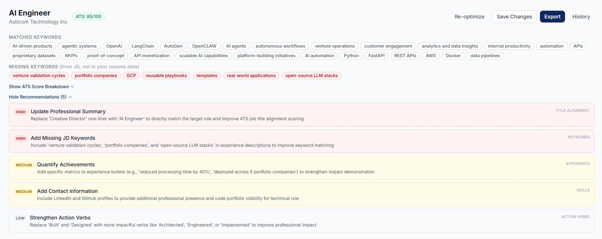
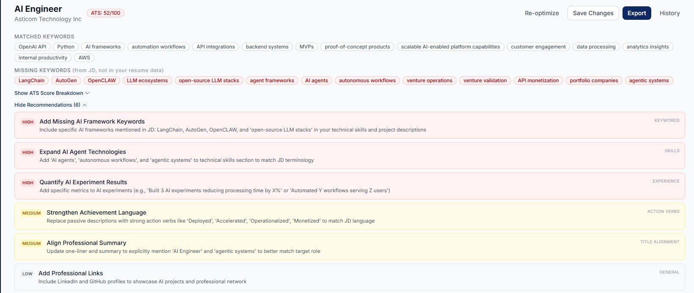
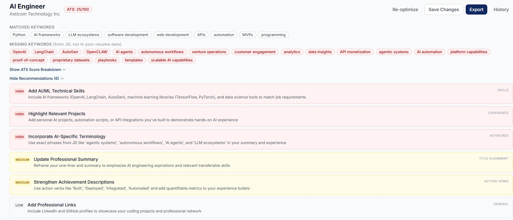

# ATS Scoring Feature - QA Test Report

## Feature Under Test
ATS Scoring

## Objective
To validate the accuracy, reliability, and usability of the ATS scoring system by testing resumes with varying levels of relevance against a real-world job description.

---

## Job Description Reference
**Position:** AI Engineer  
**Company:** Asticom Technology Inc  
**Location:** Bonifacio Global City, Taguig (Hybrid)  
**Job Listing Link:** [AI Engineer](https://ph.jobstreet.com/job/91369143?type=standard&ref=search-standalone#sol=ebf44d99ae2c93575f9f66b4396bb1a3105f4eab)

---

# Test Cases

---

## Test Case 1 – Complete Resume

### Resume Used
AI_Engineer_Complete.pdf

---

### Test Description
This resume was designed to closely match the AI Engineer job description, including:

- LLM frameworks: OpenAI, LangChain, AutoGen, OpenCLAW  
- AI agents, automation workflows, MVP development  
- API integrations, cloud deployment (AWS, Docker, GCP)  
- Data pipelines and experimentation  

This serves as the **high-quality baseline** to validate ATS scoring accuracy.

---

### Expected Outcome
- High ATS score (80–95%)
- Minimal missing keywords
- Suggestions should be minor refinements

---

### Results

| Metric | Value |
|------|------|
| Expected Score | 80–95% |
| Actual Score | 85% |
| Result Status | Pass |

---

### Missing Keywords
- venture validation cycles  
- portfolio companies  
- GCP  
- reusable playbooks  
- templates  
- real-world applications  
- open-source LLM stacks  

---

### Suggestions

**HIGH Priority**
- Update Professional Summary (Job title alignment issue detected)  
- Add missing JD keywords:
  - venture validation cycles  
  - portfolio companies  
  - open-source LLM stacks  

**MEDIUM Priority**
- Quantify achievements  
- Add LinkedIn/GitHub  

**LOW Priority**
- Improve action verbs  

---

### Screenshots

---

### QA Analysis

#### What Worked Well
- High relevance correctly identified (85%)
- Strong keyword detection for:
  - AI agents  
  - LangChain, AutoGen, OpenAI  
  - APIs, AWS, Docker  
- Suggestions are structured (HIGH / MEDIUM / LOW)

---

#### Issues Identified

**1. False Negative Keyword Detection**
- “GCP” flagged as missing despite being present  
Possible parsing or keyword matching bug  

**2. Exact-Match Bias**
- System fails to recognize semantically similar concepts  

**3. Incorrect Recommendation (Critical)**
- Suggested replacing "Creative Director" despite correct title  
Logic error in recommendation engine  

---

### QA Verdict

| Area | Assessment |
|------|----------|
| Scoring Accuracy | Good |
| Keyword Matching | Needs Improvement |
| Suggestion Quality | Incorrect Output Found |
| Overall Reliability | Moderate |

---

## Test Case 2 – Partial Resume

### Resume Used
AI_Engineer_Partial.pdf

---

### Test Description
This resume represents **moderate alignment** with the AI Engineer role:

- Includes Python, APIs, AWS basics  
- Basic OpenAI usage and small AI projects  
- Missing advanced frameworks and agent systems  

---

### Expected Outcome
- Moderate ATS score (50–75%)
- Several missing keywords
- Suggestions focused on AI frameworks and experience depth

---

### Results

| Metric | Value |
|------|------|
| Expected Score | 50–75% |
| Actual Score | 52% |
| Result Status | Pass |

---

### Missing Keywords
- LangChain  
- AutoGen  
- OpenCLAW  
- LLM ecosystems  
- open-source LLM stacks  
- agent frameworks  
- AI agents  
- autonomous workflows  
- venture operations  
- venture validation  
- API monetization  
- portfolio companies  
- agentic systems  

---

### Suggestions

**HIGH Priority**
- Add AI frameworks (LangChain, AutoGen, OpenCLAW)  
- Expand AI agent technologies  
- Quantify AI experiment results  

**MEDIUM Priority**
- Strenghten Achievement Language  
- Align professional summary  

**LOW Priority**
- Add LinkedIn/GitHub  

---

### Screenshots

---

### QA Analysis

#### What Worked Well
- Score (52%) correctly reflects partial alignment  
- Missing advanced frameworks correctly identified  
- Suggestions are relevant and actionable  

---

#### Issues Identified

**1. Semantic Matching Limitation**
- Chatbot / AI experiments not recognized as AI agents  

**2. Keyword Redundancy**
- “AI agents”, “agent frameworks”, “agentic systems” treated separately  

**3. Generic Suggestions**
- Lacks contextual guidance  

---

### QA Verdict

| Area | Assessment |
|------|----------|
| Scoring Accuracy | Good |
| Keyword Detection | Slightly Rigid |
| Suggestion Quality | Relevant |
| Semantic Understanding | Limited |
| Overall Reliability | Good |

---

## Test Case 3 – Minimal Resume

### Resume Used
AI_Engineer_Minimal.pdf

---

### Test Description
This resume represents a **low-quality baseline**:

- No AI/LLM experience  
- No relevant cloud or automation depth  
- Generic software engineering background  

---

### Expected Outcome
- Low ATS score (0–40%)
- Many missing keywords
- Strong improvement suggestions

---

### Results

| Metric | Value |
|------|------|
| Expected Score | 0–40% |
| Actual Score | 25% |
| Result Status | Pass |

---

### Missing Keywords
(OpenAI, LangChain, AutoGen, AI agents, automation, etc.)

---

### Suggestions

**HIGH Priority**
- Add AI frameworks and ML skills  
- Include AI-related projects  
- Use AI-specific terminology  

**MEDIUM Priority**
- Improve summary and achievements  

**LOW Priority**
- Add LinkedIn/GitHub  

---

### Screenshots

---

### QA Analysis

#### What Worked Well
- Score (25%) correctly reflects low alignment  
- Clear identification of missing AI skills  
- Appropriate beginner-level suggestions  

---

#### Issues Identified

**1. False Positive Keywords**
- Generic terms counted as matches (e.g., programming)  

**2. Keyword Inflation**
- Broad terms inflate score  

**3. Generic Suggestions**
- Lacks personalization  

---

### QA Verdict

| Area | Assessment |
|------|----------|
| Scoring Accuracy | Good |
| Keyword Detection | Some False Positives |
| Suggestion Quality | Appropriate |
| Precision | Needs Refinement |
| Overall Reliability | Good |

---

# Cross-Test Comparison

| Resume Type | Expected Score | Actual Score | Behavior |
|------------|--------------|-------------|---------|
| Complete | 80–95% | 85% | Strong match |
| Partial | 50–75% | 52% | Moderate match |
| Minimal | 0–40% | 25% | Low match |

---

# Overall QA Evaluation

## Strengths
- Consistent and logical score scaling  
- Clear differentiation between resume quality levels  
- Structured and relevant suggestions  

---

## Key Issues

### 1. Keyword Matching Limitations
- Over-reliance on exact matching  
- Weak semantic understanding  

### 2. False Positives
- Generic terms inflate scores  

### 3. False Negatives
- Missing detection of existing keywords (e.g., GCP)  

### 4. Suggestion Logic Issues
- Incorrect recommendations  
- Lack of contextual guidance  

### 5. Keyword Redundancy
- Similar concepts listed separately  

---

# Bug Summary

| Bug ID | Description | Severity |
|-------|------------|---------|
| BUG-ATS-001 | Missing keyword detection failure (GCP) | High |
| BUG-ATS-002 | Incorrect job title recommendation | High |
| BUG-ATS-003 | Weak semantic matching | Medium |
| BUG-ATS-004 | Keyword redundancy | Medium |
| BUG-ATS-005 | False positive keyword matches | Medium |

---

# Final Verdict

The ATS scoring system demonstrates:

- Strong baseline scoring logic  
- Effective differentiation of resume quality  

However, improvements are needed in:

- Semantic understanding  
- Keyword precision  
- Recommendation accuracy  

---

This test suite evaluates both functional correctness and system reliability under realistic user scenarios. While scoring behavior is consistent, improvements in NLP accuracy would significantly enhance trust and usability.
